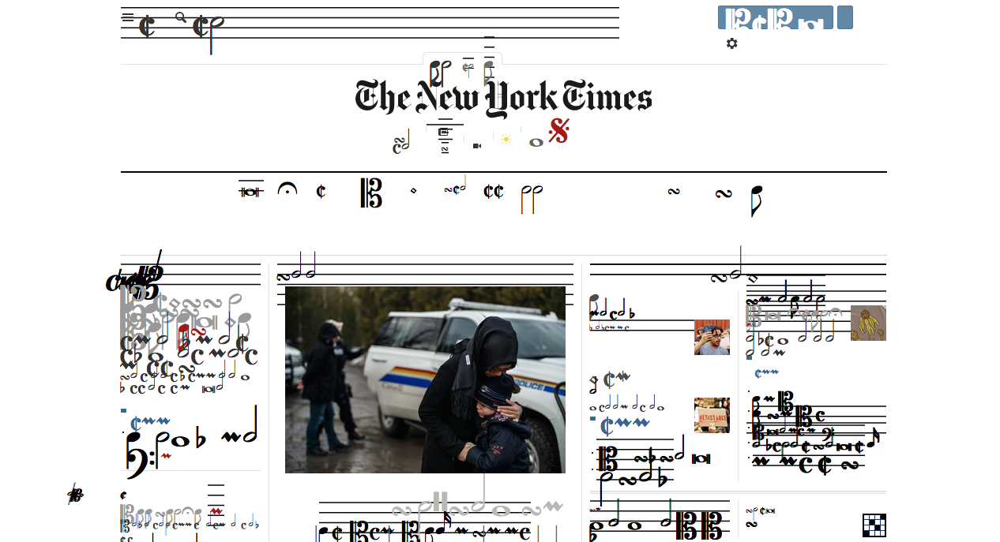
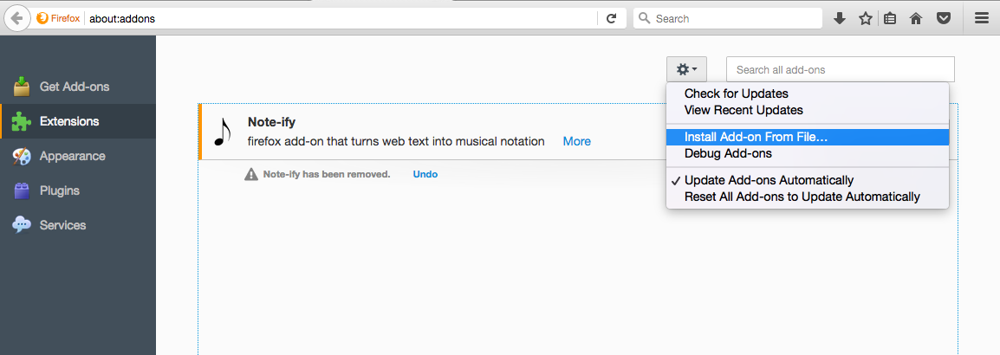

# Note-ify

Note-ify is a Firefox add-on created by [jen hill](http://jh-sound.com) for [RAGE thormbones](http://www.ragethormbones.rocks/) that turns any website into musical notation.

To install Note-ify, download [Note-ify.xpi](Note-ify_3.0.xpi). Then navigate to about:addons and select "Install Add-on From File..." from the settings menu at the top of the page and choose Note-ify.xpi.

After installing the add-on, simply ctrl+click or two-finger click anywhere on a webpage and select "Note-ify!" from the context menu and enjoy the beautiful music.

Once a page is Note-ified, all pages navigated to via link will be automatically Note-ified as well. to return to unmusical web browsing, ctrl+click or two-finger click and select "Turn Off Note-ifications" from the context menu.
